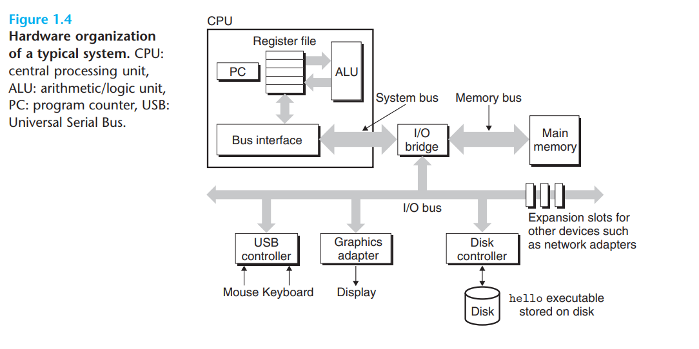
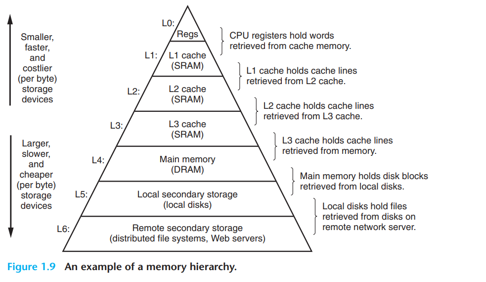

# Chapter 1: A Tour of Computer Systems

## 1.1 Information is Bits + Context

- Programs are text files represented as a sequence of bits organized into 8 bit chunks called bytes.
- **Everything, from program files, disk files, memory, network data is a bunch of bits**
- The only thing that distinguishes them is the context in which they are interpreted. The same sequence of bits can represent and integer, a string, a floating point number, or machine instruction depending on the context.
- Everything should be thought of in this way. So when you look at numbers it's not really just the number, it's the sequence of bits that represent that number.

## 1.2 Programs are translated by other programs into different forms

High level process from coding to executable using hello.c as an example:

```c
#include <stdio.h>

int main() {
    printf("Hello, world!\n");
    return 0;
}
```

hello.c -> **preprocessor** -> hello.i -> **compiler** -> hello.s -> **assembler** -> hello.o -> **linker** -> hello

1. **Preprocessing**: The preprocessor modifies the source code with directives beginning with `#`. For example, `#include <stdio.h>` is replaced with the actual content of the stdio.h header file. Output here is a new C program, usually with the `.i` extension.
2. **Compilation**: The compiler translates the preprocessed source code into assembly code. This is a text file with assembly instructions as a low-level representation of the program, usually with the `.s` extension. This will be readable to a human but confusing if you don't know assembly.
3. **Assembly**: The assembler translates the assembly code into machine code and packages them into something called a `relocatable object program`. Output here is a binary object file usually with the `.o` extension. This is going to be gibberish to a human.
4. **Linking**: The linker combines the object code with libraries and other dependencies to create an executable file. In this program the `printf` function is in a separate precompiled object file called `printf.o`. The linker handles merging this into our `hello.o` file. This creates an executable object file that can be loaded into memory and executed by the system.

### Understanding compilation systems is important

- **Optimizing program performance**
  - Don't need to understand everything about the compilers. But it's important to understand basics of how compilation works to know things like trade offs between switch vs if-else, or how much overhead is incurred by a function call. Knowing compilers helps to understand performance and memory tradeoffs of different programming paradigms.
- **Understanding link-time errors**
  - Understanding how linking works is important especially in large software systems. Reference, gloabal & static variables, runtime linking errors, etc.
- **Avoiding security holes**
  - Understanding consequences of how data and control info are stored on the program stack and buffer overflows will help fix tons of common security bugs.

## 1.4 Processors Read and Interpret Instructions Stored in Memory

You execute a program in a shell like this:

```bash
$ ./hello
Hello, world!
```

`Shell` is a command line interpreter that prints a prompt and waits for you to type a command, then executes it. If the first word of the command is not a built-in shell command, the shell assumes it is the name of a program to execute and it tries to execute it, then waits for it to terminate.

### Hardware Organization of a System



- `Buses`: collection of electrical conduits that carry bytes of info back and forth between components
  - Typically transfer fixed-sized chunks of bytes called `words` (number of bytes in a word is called the word size). Word size of 4 is a 32 bit system, and 8 is a 64 bit system.
- `I/O Devices`: System's connection to the external world. Common ones are keyboard, mouse, dis drives, network cards, etc.
  - Each device is connected to the I/O bus by a `controller` which are chip sets in the device itself or on the system's main PCB (printed circuit board) or `adapter` which is a card that plugs into a slot on the motherboard. So really only different between the two is packaging. The purpose of each is to transfer information back and forth between the I/O bus and an I/O device
- `Main memory`: temporary storage device that holds a program and its data while it is running.
  - Consists of a collection of `dynamic random access memory` (DRAM) chips. It's organized as a linear array of bytes with it's own unique address starting at zero.
  - Each of the machine instructions can consist of a variable number of bytes, and data item size can vary by type. On x86-64 linux machines **short** integers are 2 bytes, **int** are 4 bytes, etc.
- `Processor`: Central processing unit is an engine that interprets and executes instructions stored in main memory.
  - A word-size storage device (`register`) called the `program counter` that is the core of this. At any time the PC points at (or contains the address of) an instruction in the main memory
  - From the time power is applied to the system til the power shuts off a processor is repeatedly executing the instruction pointed at by the PC and updating the PC to point to the next instruction to execute.
  - the instruction execution model of a processor is defined by its `instruction set architecture` (ISA)
  - The processor only has a few simple operations that revolve around the main memory, the `register file` which is a collection of word-size registers each with its own unique name, and the `arithmetic/logic unit` (ALU) which computes new data and address values.
  - examples of simple operations that a CPU might carry out at the request of an instruction:
    - `Load`: copy a byte or word from main memory into a register, overwriting the previous value in the register
    - `Store`: copy a byte or word from a register into a location in main memory, overwriting the previous value in that location
    - `Operate`: copy the contents of two registers to the ALU, perform an arithmetic operation on the two words, and store the result in a register. This overwrites the previous value in the register.
    - `Jump`: extract a word from the instruction itself and copy that word into the Program Counter, overwriting the previous value in the PC.
  - Modern processors use much more complex mechanisms to speed up program execution than just the instruction set architecture. We can call the whole way the processor is implemented as the `microarchitecture`.

### Full execution of the hello program

1. As you type in the command `./hello` the shell reads each character into a register and then stores it in memory
2. When you press enter the shell knows the command is done and the code and data from the `hello` file are copied from disk into main memory. The data here would be "Hello, world!\n"
3. A technique called `direct memory access` (DMA) is used to copy the code and data from disk to main memory without the processor's intervention.
4. Once the code and data are in memory, the processor becauses executing the machine-language instructions in the `hello` program's main routine. The instructions copy the bytes in "Hello, world!\n" from memory to the register file, and from there to the display device where they're displayed on the screen.

## 1.5 Caches matter

Main lesson from the above process is there's a lot of time spent moving information from one place to another. A major goal for system designers is to make the copy operations as fast as possible, and a main goal for programmers is to write code that minimizes these operations.

Large storage devices are slower than small storage devices due to physical limitations. It's also easier to make processors run faster than memory run faster, this is known as the `processor-memory gap`.

To deal with this gap, the system designer's solution is to add a small, fast `cache memory` as a temporary staging area for information that the processor is likely to need in the near future.

### Cache Memories



Each level of the memory hierarchy is faster and smaller than the previous level. Knowing how these work as a programmer is useful because it helps you understand how to write code that minimizes the number of cache misses which can significantly improve performance.

The hierarchy shown shows that each smaller cache is used to store data for the larger memory store below it.

### 1.7 Operating System Managers the Hardware

Think of an `operating system` as a layer of software between the application program and the hardware. All programs trying to manipulate hardware must go through the OS.

Purposes of OS:

- Protect the hardware from misuse by programs
- Provide applications with simple and uniform mechanisms for manipulating complicated and usually different low-level hardware devices

The fundamental abstractions are `processes`, `virtual memory`, and `files`.

- `Process`: An OS's abstraction for a running program. Multiple processes can run concurrently on the same system, and each process appears to have exclusive use of the hardware.
  - `concurrently` means the instructions of one process are interleaved with the instructions of another process
  - Traditional systems could only execute one program at a time, but newer `multi-core` processors can execute several programs simultaneously.
  - But in either case a CPU can appear to execute multiple processes concurrently by having the processor switch among them. This is called `context switching`
  - `uniprocessor`: a single-core processor. `multiprocessor`: a system with multiple single-core processors. `multicore`: a system with multiple cores.
  - OS keeps track of all the state info the process needs to run which is called the `context`. Current values of the PC, register file, and the contents of main memory.
  - A context switch saves the context of the current process, restores the context of the new process, and passes control from the old process to the new one.
  
- `Threads`: an execution unit of a process that shares the same context, code, and global data.
  - Threads are typically more efficient than processes, and multi-threading is a way to make some programs run faster when multiple processors are available. More in later sections and chapters.

- `Virtual Memory`: An abstraction that provides each process with the illusion that it has exclusive use of the main memory.
  - Programs view of memory is in the `virtual address space` which has predefined regions of memory for specific purposes.
  - areas of the virtual address space include (from lowest to highest addresses in linux):
    - `Program code and data`: The executable code and its static data.
    - `Heap`: Dynamic memory allocated at runtime by the program. This can expand and contract as the program runs with things like **malloc** and **free**.
    - `Shared libraries`: The code and data for the libraries that the program is linked against. For example the standard C library
    - `Stack`: Used by the compiler to implement function calls. Also dynamically expands and contracts. At the top of the user's virtual address space
    - `Kernel virtual memory`: Very top region of the address space that applications cannot directly access. It can only be accessed by the kernel and so the kernel has to be invoked by the user/programs to access it.The kernel uses this space for its own purposes, such as storing its own code and data.

- `Files`: An abstraction that provides a way to access data in secondary storage. It's just a sequence of bytes, and every I/O device is modeled as a file. This allows for a standard interface for accessing data regardless of the underlying hardware.

### 1.8 Systems communicate with other systems using networks

A system can think of a network as **just another I/O device**. It copies a sequence of bytes from main memory to the network adapter, and the data flows to another machine rather than another device on the same machine. Similary, it can read data from a network file/adapter and copy it to main memory.

### 1.9 Important Themes

- `Amdahl's Law`: The speedup that can be achieved by improving a component of a system is limited by the portion of the system that must use the component.
  - Basically if you think about the total execution time of a program, and you speed up a component of the system that runs 10% of the time, the speedup will be limited by the 10% of the time it takes to run.
  - Lesson is to focus on the parts of the system that are used the most and improve those.

#### `Concurrency` and `Parallelism`

- `Concurrency`: a system has multiple, simultaneous activities running.
- `Parallelism`: the use of concurrency to make a system run faster
- These definitions are going to be implemented differently for different languages and are probably not that helpful right now. This is more from a systems perspective than something like python.
- `Thread level concurrency`: Can have multiple control flows executing in a single process. Think about a web server that can handle multiple requests at once.
  - The image to keep in mind is someone keeping multiple balls juggling in the air at once. This is the most basic form of concurrency on a uniprocessor system.
  - The OS scheduler switches among the threads in a process, giving each thread a small slice of time to run.
- In a multiprocessor system, multiple threads can be executing at the same time on different cores. The OS scheduler has access to all the cores and can switch among the threads in any core.
  - `Multicore` means a system with multiple independent CPUs called cores.
  - `Hyperthreading` or `Simultaneous Multi-Threading` (SMT) is a technology that allows a single physical core to simulate multiple cores by executing multiple threads at the same time. The core has multiple copies of some parts of the hardware, including the register file, program counter, but only one copy of things like the ALU
  - Look at chapter 12 for more
- `Instruction-level parallelism` (ILP) is the ability of a modern processor to execute multiple instructions at the same time.
  - Look at chapter 4 for more
  - Early processors took 3-10 clock cycles per instruction, but modern processors can execute 2-4 instructions per clock cycle using clever tricks like `instruction pipelining` (breaking down instructions into stages and executing them in parallel). Any processor that can execute multiple instructions per clock cycle is called `superscalar`.
- `Single-Instruction, Multiple-Data` (SIMD) is a technique that allows a processor to execute the same instruction on multiple data items at the same time.
  - Very applicable to graphics processing and for video, images, and sound.
  - Example would be adding 8 pairs of floating point numbers at once.
  - GCC vector types are an example of a data type that allows for SIMD operations. I think numpy might also use this for "vectorized" operations?

#### Importance of Abstractions

Computers and programs are hard. Abstractions help you to use the systems without having to worry about all the details.

Abstractions provided by computer systems:

- `instruction set architecture`: the set of instructions that a processor can execute.
- We went over OS abstractions earlier
- `Virtual machine` - an abstraction of a entire computer
